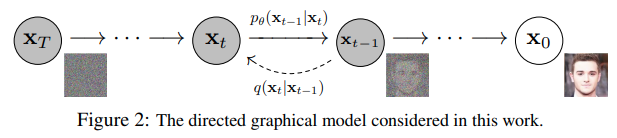

</img>

## Denoising Diffusion Probabilistic Model, in Pytorch

Implementation of <a href="https://arxiv.org/abs/2006.11239">Denoising Diffusion Probabilistic Model</a> in Pytorch. It is a new approach to generative modeling that may <a href="https://ajolicoeur.wordpress.com/the-new-contender-to-gans-score-matching-with-langevin-sampling/">have the potential</a> to rival GANs. It uses denoising score matching to estimate the gradient of the data distribution, followed by Langevin sampling to sample from the true distribution.

This implementation was transcribed from the official Tensorflow version <a href="https://github.com/hojonathanho/diffusion">here</a>


[](https://badge.fury.io/py/denoising-diffusion-pytorch)


## Usage

```python train.py
```python test.py

Samples and model checkpoints will be logged to `./results` periodically

## Citations

```bibtex
@inproceedings{NEURIPS2020_4c5bcfec,
    author      = {Ho, Jonathan and Jain, Ajay and Abbeel, Pieter},
    booktitle   = {Advances in Neural Information Processing Systems},
    editor      = {H. Larochelle and M. Ranzato and R. Hadsell and M.F. Balcan and H. Lin},
    pages       = {6840--6851},
    publisher   = {Curran Associates, Inc.},
    title       = {Denoising Diffusion Probabilistic Models},
    url         = {https://proceedings.neurips.cc/paper/2020/file/4c5bcfec8584af0d967f1ab10179ca4b-Paper.pdf},
    volume      = {33},
    year        = {2020}
}
```

```bibtex
@InProceedings{pmlr-v139-nichol21a,
    title       = {Improved Denoising Diffusion Probabilistic Models},
    author      = {Nichol, Alexander Quinn and Dhariwal, Prafulla},
    booktitle   = {Proceedings of the 38th International Conference on Machine Learning},
    pages       = {8162--8171},
    year        = {2021},
    editor      = {Meila, Marina and Zhang, Tong},
    volume      = {139},
    series      = {Proceedings of Machine Learning Research},
    month       = {18--24 Jul},
    publisher   = {PMLR},
    pdf         = {http://proceedings.mlr.press/v139/nichol21a/nichol21a.pdf},
    url         = {https://proceedings.mlr.press/v139/nichol21a.html},
}
```
